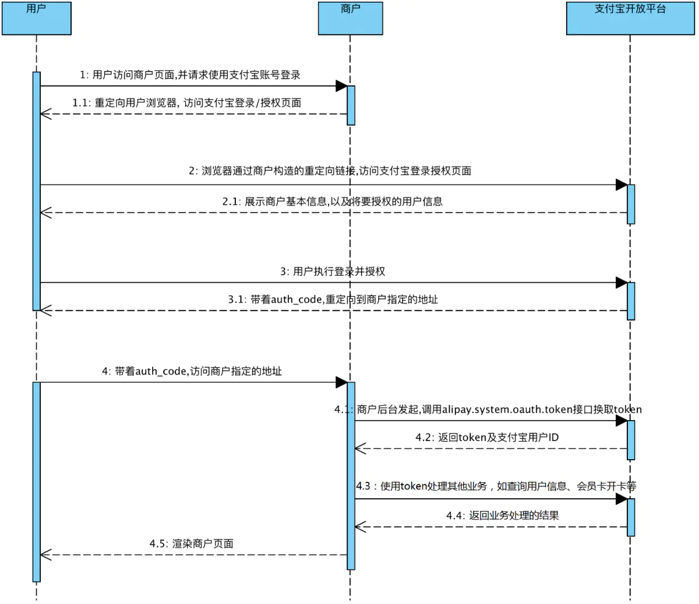
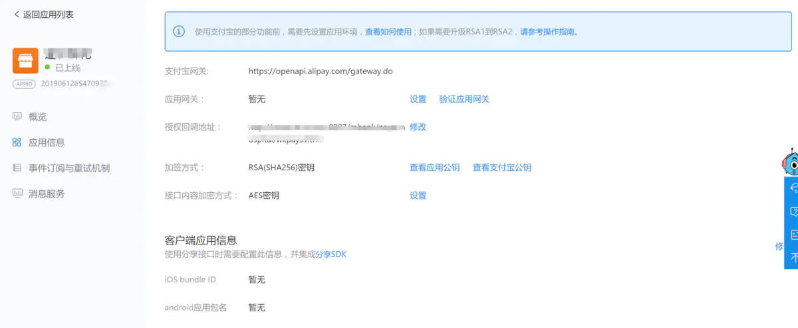

# 支付宝授权
{: .no_toc }

## Table of contents
{: .no_toc .text-delta }

1. TOC
{:toc}

---

### 支付宝授权
---------------------

#### 支付宝手机网站下单:

https://opendocs.alipay.com/open/203/107090/

#### 获取用户信息

PC 网页内获取用户信息 : https://opendocs.alipay.com/open/284/web

生活号/H5内获取用户信息: https://opendocs.alipay.com/open/284/h5

#### 支付宝获取userid的流程。

如果只是要获取用户的userid，可以使用支付宝静默授权方式。

1.授权流程



2.商户配置




需要开发的是：

(1) 根据支付宝商家的appid获取到auth_code，

(2) 使用auth_code换取access_token与user_id、

(3) 使用token完成其他业务处理，如token换取用户信息等；或者是与userid完成实名认证。

相关参数：

|参数名 	|是否必须|长度 	|描述|
|-------|-------|-------|----|
|app_id 	|是 	|16 	|开发者应用的app_id； 相同支付宝账号下，不同的app_id获取的token切忌混用。|
|scope 	|是 	|不定，取决于请求授权时scope个数 	|接口权限值，目前只支持auth_user（获取用户信息、网站支付宝登录）、auth_base（用户信息授权）、auth_ecard（商户会员卡）、auth_invoice_info（支付宝闪电开票）、auth_puc_charge（生活缴费）五个值;多个scope时用”,”分隔，如scope为”auth_user,auth_ecard”时，此时获取到的access_token，既可以用来获取用户信息，又可以给用户发送会员卡。|
|redirect_uri 	|是 	|100 	|授权回调地址，是经过URLENCODE转义 的url链接（url必须以http或者https开头）； 在请求之前，开发者需要先到开发者中心对应应用内，配置授权回调地址。 redirect_uri与应用配置的授权回调地址域名部分必须一致。|
|state 	|否 	|100 	|商户自定义参数，用户授权后，重定向到redirect_uri时会原样回传给商户。 为防止CSRF攻击，建议开发者请求授权时传入state参数，该参数要做到既不可预测，又可以证明客户端和当前第三方网站的登录认证状态存在关联 |


根据appid获取到auth_code的URL拼接规则：

```
https://openauth.alipay.com/oauth2/publicAppAuthorize.htm?app_id=APPID&scope=SCOPE&redirect_uri=ENCODED_URL
```

注意：
```
1.redirect_uri的地址和支付宝商家配置的回调地址域名应该相同，否则会提示找不到页面。
2.如果使用静默授权请将scope设置为auth_base。
3.其他的与授权无关的参数可以直接拼接到redirect_uri或者存放到state字段，授权回调时会将参数原样返回。
```

**授权回调** 

当用户授权成功后，会跳转至开发者定义的回调页面，支付宝会在回调页面请求中加入参数，包括auth_code、app_id、scope等，支付宝请求开发者回调页面示例如下：
```
http://demo.zhangxiaocai.cn/apipay?app_id=2016032301002387 &scope=auth_user&auth_code=10e20498fe5d42f18427d893fc06WX59

http://demo.zhangxiaocai.cn/apipay?app_id=2016032301002387 &scope=auth_user&auth_code=10e20498fe5d42f18427d893fc06WX59
```

返回参数说明：

|参数名 	|是否必须|长度 	|描述|
|-------|-------|-------|----|
|app_id 	|是 	|16 	|开发者应用的app_id；相同支付宝账号下，不同的app_id获取的token切忌混用。|
|scope 	|是 	|不定，取决于请求授权时scope个数 	|成功授权的接口权限值，目前只支持auth_user（获取用户信息、网站支付宝登录）、auth_base（用户信息授权）、|auth_ecard（商户会员卡）、auth_invoice_info（支付宝闪电开票）、auth_puc_charge（生活缴费）五个值;多个scope时用“,”分隔，如scope为“auth_user,auth_ecard”时，此时获取到的access_token，既可以用来获取用户信息，又可以给用户发送会员卡|
|error_scope 	|否 	|不定，少于请求授权时scope个数 	|error_scope表示授权是失败的scope列表及对应的错误信息（错误列表之间用“|
|state 	|否 	|100 	|商户自定义参数，用户授权后，重定向到redirect_uri时会原样回传给商户。 为防止CSRF攻击，建议开发者请求授权时传入state参数，该参数要做到既不可预测，又可以证明客户端和当前第三方网站的登录认证状态存在关联。|
|auth_code 	|是 	|目前为32，后期会根据安全策略适当调整，请勿限制该字段长度。 	|临时授权码，一次性有效，同时若超过有效期未使用，则会失效。有效期目前至少为5分钟，最长为24小时。请获取auth_code后尽快通过调用alipay.system.oauth.token接口获取访问令牌|


在sdk的帮助下用auth_code交换到userid（java示例）
在获取auth_code后，会到后台调用sdk方法，根据密钥和支付宝公钥交换到userid：

```java
AlipayClient alipayClient = new DefaultAlipayClient("https://openapi.alipay.com/gateway.do", APP_ID, APP_PRIVATE_KEY, "json", CHARSET, ALIPAY_PUBLIC_KEY, "RSA2",proxyHost, proxyPort); 
AlipaySystemOauthTokenRequest request = new AlipaySystemOauthTokenRequest();
request.setCode("2e4248c2f50b4653bf18ecee3466UC18");
request.setGrantType("authorization_code");
String userId = null;
try {
    AlipaySystemOauthTokenResponse oauthTokenResponse = alipayClient.execute(request);
    userId = oauthTokenResponse.getUserId();
} catch (AlipayApiException e) {
    //处理异常
    e.printStackTrace();
}


AlipayClient alipayClient = new DefaultAlipayClient(
                                WxAliPayConstants.alipay_user_accredit_url, app_id,
                                WxAliPayConstants.rsa_private_key, "json", "UTF-8",
                                WxAliPayConstants.alipay_public_key, "RSA2");
AlipaySystemOauthTokenRequest alipayrequest = new AlipaySystemOauthTokenRequest();
alipayrequest.setGrantType("authorization_code");
alipayrequest.setCode(code);

AlipaySystemOauthTokenResponse responseToken = null;
try {
	responseToken = alipayClient.execute(alipayrequest);
} catch (AlipayApiException e) {
	errormessage = "支付宝授权获取userid链接失败";
	throw new Exception(errormessage);
}
			
``` 