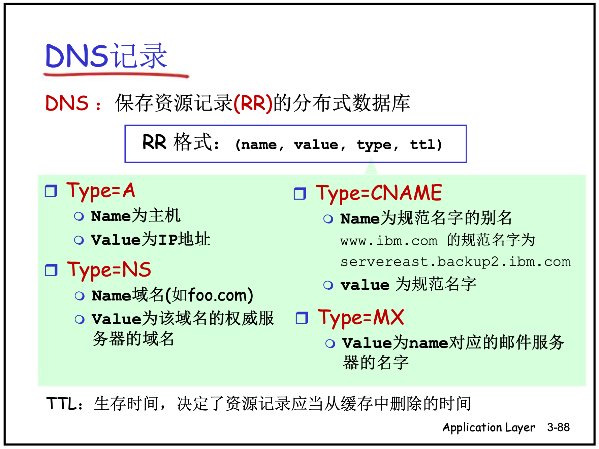

# Windows
{: .no_toc }

## Table of contents
{: .no_toc .text-delta }

1. TOC
{:toc}


## windows 端口占用

```text
netstat -aon | findstr :8088
```

找到对应的PID,根据PID找到对应的服务名称

```text
tasklist|findstr “8088”

tasklist /fi “PID eq 12824”
```

任务

```sql
taskkill /pid 8088 /F
```


## windows 端口转发

windows 添加端口转发
```text
netsh interface portproxy add v4tov4 listenaddress=127.0.0.1 listenport=9000 connectaddress=37.220.51.222 connectport=1521
```

windows 移除端口转发

```text
netsh interface portproxy delete v4tov4 listenaddress=127.0.0.1 listenport=9000
```

## win10 SSH

安装open ssh服务

启动ssh服务

```
net start sshd
```

查看登录用户
```
net user
```

停止ssh服务

```
net stop sshd
```
也可以在"服务"里操作。


## nslookup

nslookup 全称:name server lookup。

它有两种模式:交互 & 非交互，进入交互模式在命令行界面直接输入nslookup按回车，非交互模式则是后面跟上查询的域名或者IP地址按回车。一般来说，非交互模式适用于简单的单次查询，若需要多次查询，则交互模式更加适合.

RR (Resource Records) – 来自WIKI百科以及计算机网络: 自顶向下(7th)

资源记录（RR）是包含了下列字段的4元组：
(Name, Value, Type, TTL)

- 主机记录（A记录）：RFC 1035 定义，A记录是用于名称解析的重要记录，提供标准的主机名到IP的地址映射。
- 别名记录（CNAME记录）: RFC 1035 定义，向查询的主机提供主机名对应的规范主机名。
- 域名服务器记录（NS记录） ：用来指定该域名由哪个DNS服务器来进行解析。 您注册域名时，总有默认的DNS服务器，每个注册的域名都是由一个DNS域名服务器来进行解析的，DNS服务器NS记录地址一般以以下的形式出现： ns1.domain.com、ns2.domain.com等。 简单的说，NS记录返回域中主机IP地址的权威DNS服务器的主机名。
- 邮件交换记录（MX记录）：返回别名为Name对应的邮件服务器的规范主机名。




## windows 软连接

windows 在 win10 创建类似 linux 的软链接，需要开启开发人员模式（在「设置」搜 develop）。

命令：`mklink`

删除：`rmdir`

创建：
```
mklink D:\ghi.txt C:\Users\Tom\Desktop\test-link\abc\ghi.txt
```

删除：

```
rmdir D:\ghi.txt 
```

- 参数顺序跟 linux 相反，即先软链接名（link file）后源文件（source file）；且就算软链接名跟源文件同名，也不可省略。
- 如果当前就在 D:\，第一个参数（软链接名）可以去掉路径前缀。
- 第二个参数（源文件）也可以用相对路径，但这样把软链接移去其它路径就会引用失败。所以首选绝对路径。

创建符号链接。

MKLINK [[/D] | [/H] | [/J]] Link Target

-    /D      创建目录符号链接。默认为文件符号链接。
-    /H      创建硬链接而非符号链接。
-    /J      创建目录联接。
-    Link    指定新的符号链接名称。
-    Target  指定新链接引用的路径
            (相对或绝对)。
            
```text
mklink D:\ghi.txt C:\Users\Tom\Desktop\test-link\abc\ghi.txt
```

windows 添加软连接

```text
mklink /j "C:\Program Files\Docker\"  "D:\apps\docker"
```
windows 移除软连接

```text
rmdir "C:\Program Files\Docker\"
```


## 内外网同时使用


```bash
route delete 0.0.0.0 

route delete 21.117.0.0

# 添加默认路由为当前无线网的默认网关
route -p add 0.0.0.0 mask 0.0.0.0 192.168.120.1

# 添加默认路由为当前有线网的默认网关
route -p add 21.117.0.0 mask 255.255.0.0 132.230.50.254
route -p add 21.117.0.0 mask 255.255.0.0 172.16.20.1
```


## windows 添加右键菜单


### 1、右键菜单对应注册表位置

不同情形下的注册表位置如下:

（1）右键空白区域

桌面空白区域

> HKEY_CLASSES_ROOT\DesktopBackground\Shell

一般空白区域

 - **管理员**	HKEY_CLASSES_ROOT\Directory\Background\shell
 - **普通用户**	HKEY_CURRENT_USER\Software\Classes\directory\Background\shell

（2）右键文件夾

 - **管理员**设置注册表路径: HKEY_CLASSES_ROOT\Directory\shell
 - **普通用户**设置注册表路径:\HKEY_CURRENT_USER\SOFTWARE\Classes\Directory\shell

（2）右键文件

 - **管理员**	HKEY_CLASSES_ROOT\*\shell
 - **普通用户**	HKEY_CURRENT_USER\Software\Classes\*\shell 
 
 
### 2、添加注册表
 
1、打开注册表编辑器

快捷键为“Windows+R”，打开 “运行”窗口，输入 RegEdit，然后点击“确定”。

此示例为普通用户添加

2、在 `HKEY_CURRENT_USER\Software\Classes\*\shell` 下，点击shell，右键新建项 Notepad++，在 Notepad++ 下新建项 command。

3、点击Notepad++

鼠标左键双击右侧的默认名称或者右键点击修改，修改数据为Notepad++（右键菜单中显示的名称）。

4、在空白处右键新建字符串，命名为【Icon】，修改默认数据为"Notepad++.exe路径"+", 0"，如

> D:\\apps\\Notepad++\\Notepad++.exe, 0


5、点击【command】，鼠标左键双击右边默认名称或者右键点击修改，修改默认项的数据为"Notepad++.exe路径"+"空格"+"%1"，如:

> D:\\apps\\Notepad++\\notepad++.exe %1

6、设置完成，右键多了 notepad++ 菜单选项。


复制以下代码保存为 `Notepad++.reg`，修改自己的"Notepad++.exe路径"后，双击运行Notepad++.reg。

```
Windows Registry Editor Version 5.00

[HKEY_CURRENT_USER\*\shell\NotePad++]
@="Notepad++"
"Icon"="D:\\apps\\Notepad++\\notepad++.exe,0"

[HKEY_CURRENT_USER\*\shell\NotePad++\Command]
@="D:\\apps\\Notepad++\\notepad++.exe %1"


```

其他软件类似。