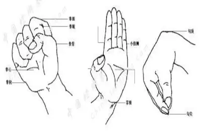

# 手型
{: .no_toc }

传统武术手型相关素材。来源：[https://www.bilibili.com/read/readlist/rl230499](https://www.bilibili.com/read/readlist/rl230499) .
{: .fs-6 .fw-300 }

## Table of contents
{: .no_toc .text-delta }

1. TOC
{:toc}

---

## 传统武术手型之爪型

爪型：五指张开或并拢。第三、二指节屈扣或伸直，称为爪，象形拳中常出现。

### （一）螳螂爪

螳螂爪：五指聚起，侧屈腕，手型仿螳螂前爪，类似刁勾，名"螳螂爪"。

### （二）鹰爪

鹰爪拳和形意拳的鹰爪:五指分开、指尖回扣如鹰爪抓物状(图7.19)。南拳的鹰爪:拇指外展弯曲,其余四指并拢,并且第二、三指骨用力弯曲,爪心微含成“凹型(图7.20)。

### （三）虎爪

南拳手型之一,做法有三种:

其一,五指用力分展,第一、二指节微屈,手背屈紧,掌心成“凸型(图7.21)。

其二,拇指弯曲并紧扣于虎口处,其余四指并拢或微分屈曲第一、二指关节,腕关节微屈(图7.22)

其三,五指分开,各指关节微屈,手背微屈,掌心成“凹型(图7.23)

### （四）龙爪

龙爪有两种:其一,五指微张开,第一、二指指骨稍弯曲;其二,拇指张开,四指并拢向上翘张,指根内凸,第一节回扣,手心朝下,腕内屈(图7.24)

### （五）猴爪

猴爪是猴拳和少林拳的手型,五指向内屈拢,并不捏拢,半开半闭(图7.25)

## 传统武术手型之拳型

手有五指，拇指两节露于掌外，其他四指三节露于掌外。手指的屈与伸、分与合、松与紧形成了多种手型。中国武学中的手型，主要有掌、拳、勾、爪、指等，是武术技法的基本内容之一。

 

### 拳掌勾

不同的手型，形状结构不同，功能特点也不同，攻防运用技法各具变化，实践中变换使用，互相配合。武术手型在发展过程中受到了道家、佛家修炼，以及经络思想的很大影响。由于中国武术拳种流派众多，各门派的手型有共同点，也有差别，丰富多彩。对于手型的命名也不尽相同，存在同一手型有多种名称，以及名称相同而手型不同的现象。这里选有代表性的若干种加以说。

五指卷握称为拳，拳的种类很多，主要分为实拳和虚拳两大类。
### 一、实拳：

1. 平拳：指食，中，无名，小指向内卷曲，握紧，拇指扣在食指和中指的第二指节处(图40)。

2. 螺形拳：螺形拳是按小指、无名指、中指、食指的次序，依次向手心卷握，拇指屈扣于食指和中指第二骨节击人之拳法，是以拇指扣二指节上，拳面成螺旋形斜面而成的拳。

3. 凤眼拳（单珠拳）：凤眼拳专练食在食指甲上，食指第二骨节向前突出，拇指与食指扣成凤眼状，其主要用来击打穴位，穿透性强，该拳左右手均可习练。

 

4. 封眼拳：封眼拳是由四指向掌心卷握，拇指屈压于拳眼上而成。封眼拳实用于冲、击、砸等技法。多是少林类拳术的拳型。

5.双珠拳：双凤眼拳又名双珠拳、双枣拳，南拳常用手型之一。握拳时，除食指和中指的第一、二节指关节突出拳面外，其余四指紧握，拇指的第二节指骨顶压在食指和中指的第三节指骨上。

6.透骨拳（尖拳）：中指紧扣，突出成尖，其余四指弯曲紧握，拇指压于中指接近第一指节处，减少接触敌身体的面积，从而增大压强，提高杀伤力。

 7. 瓦楞拳：四指并拢卷曲，食指紧扣于虎口内侧，其余三指依次微凸起，拇指紧扣于食指第二指节骨上。通背拳重要手型。

### 二、虚拳：

1.羌子拳：食指，中指，无名指和小指并紧，四指的第二节第三节指骨紧屈，拇指向内弯曲，紧贴食指，拇指尖掐按于食指稍节部。

2. 端杯手：中指、无名指、小指回扣紧握，拇指按压在中指、无名指第二指节上，食指弯曲回勾成半圆状。

3.凤凰眼手：中指、无名指、小指回扣紧握，拇指食指成钳状。

4.空心拳(又称半握拳)：空心拳是由四指并拢向掌心弯曲。拇指屈压于食指与中指屈节上 ，，拳心虚空，似握着一椭圆形小球的拳。

## 传统武术手型之勾型和指型

### 勾型

1.飞鹤勾：既食指、中指、无名指和小拇指略展开，拇指贴于中指第二骨节处，向后弯屈成勾手（图6）。

 

2.鹤顶勾（刁勾）：长拳是五指尖撮拢在一起，屈腕。这种拳钩在少林拳中称刁钩，南拳称鹤顶勾，其特点是既能使手型变化快，又能有利于勾带。（图7）

 

3.鹤嘴勾：直腕，五指自然内合，指尖捏拢。（图8）

### 指型

1. 剑指，也叫剑诀，双指，其姿势为无名指和小指弯屈，令拇指压在该二指的指节（从指根数起）上，食指中指并拢伸直。是道教施法时的手势，也是武术中代表剑的指形。

2. 金剪指是在剑指的基础上将食指、中指分开而成。其规格要求直指挺直,屈指空握。多以指尖为力点。 实用于点、叉、戳、刺等指法。多以南拳类指型。

3. 金铲指：四指伸出绷紧，拇指贴于掌心

4. 倒夫指：拇指、食指伸出，其余三指弯曲于掌心。

5. 金刚指：金刚指是由食指挺直，中指、无名指、小指卷屈于掌心，拇指扣压于中指、无名指第二指节上而形成的指型。其规格要求食指挺，握指紧，腕节直。多以指尖为力点。实用于点、戳、钻、刺等技法。多以少林类点穴法指型。

6. 单指（南拳）：食指伸出，其余四指微屈带力。

7. 双指（南拳）：食指、中指伸出，其余三支微屈带力。

8.佛手：中指和无名指紧屈，其余三指伸直。

9.龙手：也称蛇手，四指并拢伸直，拇指外展并向内收。

10.猴手：五指向内屈拢，但不捏在一起。

## 传统武术步型与步法

（一）基本步型

按照两腿与两脚的空间不同，可将步型分为：左右开步式、前后错步式、交叉式、并立式与独立式五种。

1、左右开步式：即两脚向左右两侧横向分开的步型。包括马步、八字步、仆步、撗裆步、丁开步等。

2、前后错步式：即两脚前后纵向分开的步型。包括弓步、半马步、三体步、虚步、前点步、坐步、跪步、骑龙步等。

3、交叉辗转式：即两腿前盖后插或原地蹍转形成交叉的步型。包括歇步、坐盘、交叉步等。

4、双脚并立式：即两脚靠拢站立的步型。包括丁步、丁字步、并步等。

5、独立式：即一腿支撑身体，另一腿离开地面悬空的步型。鸡步、前提膝步、侧提胯步、扣膝步、独立步（后几种一般来说，不属于步型，归并到平衡动作中）等。

不同的拳种，采用的步型也有所不同。其中，弓步、马步、虚步、歇步、仆步、丁步是最常用的基本步型。

1.马步：两脚左右开立（距离约为三脚长），两脚掌平行着地，足尖朝前，屈膝下蹲，膝盖不超过足尖，大腿接近水平。身体重心落于两腿之间，两足跟外展，身体正直，头微上顶，眼视前方。

要求：开胯圆档，膝展腿平，挺胸塌腰。

2.弓步：两脚前后开立（前脚跟与后脚尖距离约四脚长），前腿屈膝半蹲接近水平，足尖朝前并微内扣，膝与足尖垂直，脚掌着地；后腿挺膝蹬直，足尖外撇45度，两脚掌全着地，身体正直向前。

要点：前腿弓，后腿绷，挺胸抬头勿晃动。

3.仆步：一腿屈曲下蹲，大小腿靠紧，臀部接近小腿，足尖外撇45度，膝外展；另一腿挺直侧伸，足尖里扣；身体中正略微前倾；双目向仆腿方向注视。

右腿伸直称“右仆步”，反之为“左仆步”。

要点：全脚掌着地，不可掀后足跟。挺胸、直背、塌腰。重心要牢，不可左右倾斜。

4.歇步：两腿交叉下蹲，前脚尖外撇45度，全脚掌着地；后脚足跟提起，前脚掌着地，臀部下坐于小腿上，身体挺起；目视侧前方。

要求：挺胸塌腰，臀部内敛，两腿并拢靠紧，重心稳固。

5.虚步：两脚前后开立，后脚全脚着地，足尖外展45度，大腿屈曲半蹲，接近水平；前腿微屈，前足尖内侧点地，足跟提起，膝内扣。重心主要在后腿；目平视前方。

要求：后脚全足掌着地，五趾抓地，膝要收。挺胸、塌腰，虚实分明。

6.丁步：两腿并拢相靠，屈膝下蹲，一脚全脚掌踩地支撑，另脚足跟提起脚尖点地，脚面绷平，贴靠于支撑脚足弓处，重心下降，腿屈曲下蹲，近于水平，挺胸抬头，身体朝前方；目视前方。

要求：挺胸、塌腰，身略内敛；支撑腿要蹲平，两足稳固，重心偏于支撑脚上。

（二）进阶步型

中国武术步型繁多，在弓、仆、虚、歇、丁、马的基础之上可以进行进阶的步型练习大概包括以下这些。

长拳属于少林北派一枝。讲究手、眼、身、法、步；精、神、气、力、功。其中的步，就是指步型、步法而言。其步型有以下几种：

南拳是以福建南少林寺为正宗的南派少林拳法。讲究“心、神、意、气、力；手、眼、身、腰、马”。其中“马”就是指步型、步法而言。其步型如下：

（三）步型、步法的训练

知道了步型步法的标准和要求，就可以开始训练了。训练的方法，各门各派各有不同。不过大体上都是从简到繁，由易到难。下面我们就一般的训练方法谈一谈。

(1)阴阳步(或称两仪步)训练法。这种训练法就是将两脚站立在两点上，或左右、或前后、或高跳相互转换步型。两点间的距离，以自身步型距离为标准。

(2)三角步(或称三才步)训练法。这种训练法就是以自身步型距离为边长，画一个等腰三角形，两脚可以在三点上任意进行步行的转换。

(3)四门步训练法。既以自身步型距离为边长画一个正方形，取角上四点为落脚点，使步型、步法在四点上任意进行转换。

(4)五行步(或称梅花步)训练法。既在四门步正中间再加—点，使步型、步法可以更多的参加训练。

(5)七星步(或称天罡步)训练法。就是以自身步型距离为长度，以北斗七星所排列的位置为落脚点，使步型、步法在其上任意进行转换。

(6)八卦步训练法。按乾、坎、艮、震、巽、离、坤、兑八个方位(即东、西、南、北、西南、西北、东南、东北)，以自身步型距离为两点之间的长度，取八点，围成一个圆形。将步型、步法在八点上任意进行转换。

(7)九宫步训练法。既在八卦之中再加一个落脚点。

(8)十面埋伏训练法。既在八卦之中再加两个落脚点。

刚开始时，可在平地上练习，每个落脚点画一个圆圈。等各种步型、步法熟练、定型后。再在落脚点上加垫一块红砖，等到在砖上习练纯熟后，可在落脚点上再加一块红砖，等到在三块红砖上面习练纯熟后，再撤去红砖，扣上饭碗，脚踏碗底，在上面进行步型、步法的转换训练。(也有在圆簸箩中装满沙子，在簸箩边上走步，每日将沙子一点一点抓出。此法上要练习脚步轻快，习练轻功都用此法)。等到在碗底上习练精熟后，就可以在木桩上练习了，要循序渐进，从低到高，从慢到快，

（四）十二种基本步法

武术界历来就有“传拳不传步，传步打师父”之说，可见步法在实战中的重要性。把拳脚练得再好如没有灵活的步法则难以接近对方取得有效的打击。

1、上步

上步的动作方法是：一脚向前一步或半步后成一定步型。

上步后常伴随进攻技法，如上步冲拳等。

注意：①上步要轻灵稳健。②上步要一次到位，做到规范标准。

2、跟步

跟步的动作方法是：一脚向前上一步，另一脚随后跟上半步或一步，落在前脚后面。

跟步多是形意拳配合手法的步法，如跟步崩拳等。它能增强上步进攻力量和威力。

注意：①上体正直，跟步稳健。②前脚上和后脚跟节奏分明，连接紧凑。

3、退步

退步的动作方法是：一脚向后退半步或一步，或两脚依次后退。

退步主要用于防守对方进攻。

4、撤步

撤步的动作方法是：一脚向后退半步或一步，另一脚随之向后撤半步或一步，停落在后脚前。

撤步主要配合冲拳，格挡等手法，用于退守，并在退守同时能伺机反攻。

注意：①退、撤要分明。②要有伺机反攻的意识。

5、交叉步

交叉步是两腿侧向交叉走步。其动作方法是：一腿向另一腿前面交叉，侧面迈步称为迈步走。一腿向另一腿后面侧向插步为偷步走。

交叉步主要用于闪避对方的正面攻击，并从侧面进攻对方。

6、倒插步

倒插步的动作方法是：两脚开立，重心移至一腿支撑，另一腿向支撑腿后横迈一步，前脚掌着地，脚跟踮起，支撑脚全脚着地，脚尖外撇，膝部屈弓。左脚在前，称为左交倒插步，右脚在前，称为右倒插步。

倒插步攻击中多用于侧向偷步，转身鞭拳攻击对方。

注意：①要拧身、挺胸、合胯。②两腿交叉虚实分明。

7、行步

行步的动作方法是：两腿微屈（或半蹲），两脚快速、连续地向内侧前方弧形行走步。顺时针右弧形走时，左脚尖微内扣，右脚尖微外撇。逆时针向左弧形走时，右脚尖微内扣，左脚尖微外撇。

行步是佯攻性技法，避实就虚，边线进攻。

注意：①挺胸立背，拧腰裹胯。②行步平稳、轻快，步幅均匀，重心平稳无起伏。

8、八卦步

八卦步的动作方法是：侧对圆心，并步站立屈膝稍蹲或半蹲。两脚沿圆圈行走，里脚直进，外脚上步扣脚，两脚平起平落，似擦地面而行。上体含胸拔背，拧腰坐胯。眼平视圆心。

八卦步主要是避实就虚，寻找战机，乘虚而入。

注意：①要顶头、拧腰、坐胯。②行步时，圈要圆，步要顺。③两腿裹扣，脚心空含，五趾抓地。④行走过程中重心平稳，防止起伏。⑤初学时速度由慢到快，姿势由高到低，时间逐渐加长。

9、三角步（又称骑龙步）

三角步的动作方法是：并步抱拳，左脚向右前方上步，脚尖外撇屈膝，右腿屈膝前跪，脚跟提起，身体对右前弓。上体左转，同时右脚经前向左前方绕上一步，脚尖内扣，屈膝，左腿屈膝跪腿，脚跟提起，眼向左看。左脚向左侧上步成左弓步。右势相同，左右腿动作交换。

三角步主要用于避实就虚，从侧面攻击对方。是南拳常用步法。

注意：①步法灵活稳健。②动作连贯圆活。③重心平稳，防止起伏。

10、踏步（又称振脚）

踏步的动作方法是：并步站立，一腿屈膝上提，支撑腿屈膝下蹲的同时全脚掌用力向地面踏击。

踏步主要用于助威、助势或踏对方脚面。

注意：①下振借助蹲身之势。②全脚掌着地。

11、击步

击步的动作方法是：并步叉腰，左脚向左侧直腿点地。左转体，身体前倾，右脚提离地面，左脚随即蹬地向前上跳起，右脚迅速以脚内侧在空中碰击左脚跟。碰击后右脚先落地，左脚再前落或侧点步。右势动作相同，方向相反。

击步用于攻击对方下部，或解脱对方2对自己下部的威胁。长拳套路中多作为跳跃动作助跑之用。

注意：①身正、挺胸、提气。②纵跳、碰击、落步要连贯。

12、跃步

跃步的动作方法是：一脚蹬地踏跳，向前腾跳，另一脚随势向前摆跳。落地时踏跳脚腿落于后，摆跃腿落于前。落地可成仆步、弓步等步型。

跃步主要用于快速接近随访，施展攻击。

注意：①跳跃时尽量高、远。②落步要轻、稳。

（五）步法歌诀：

步法奥妙在节奏 不识节奏枉为功

前步似踩又似踏 后步似甩又似蹚

疯牛怒虎气势雄 全凭节奏建奇功

玩得节奏真谛后 再探整体行动功

后驱逆行指腿脚 摇臀荡胯似秋风

说步不仅指腿脚 全身配合总相宜

突发立止猛扑到 气势浑雄使人惊

两拳相交不为能 大形过位方英雄

千古传艺说绝密 不传步法是其中

劝君学拳多识步 仔细玩味得精髓

说难不难难亦难 不得耳聆亦枉然

